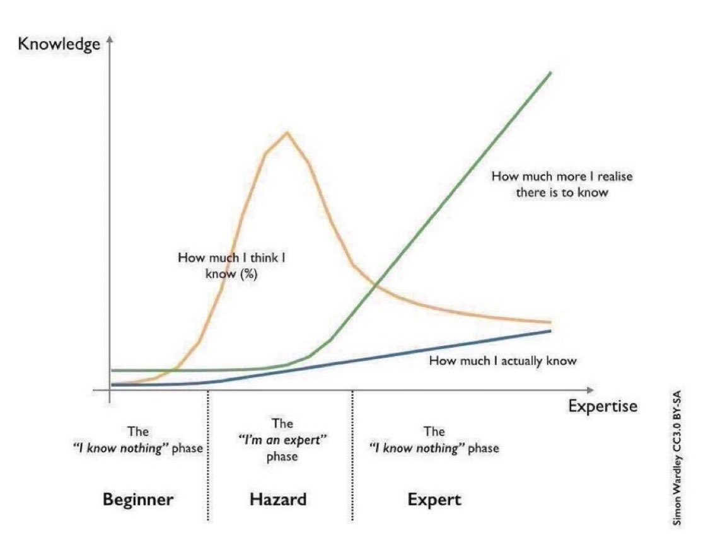

### Hello friend!

- My name is Atilla. I'm a developer with background in front-end and backend who loves to learn new technologies and share his knowledge with others.
<br/>
- My main focus is on javascript, but I also have experience with other languages and frameworks.
  
<br/>
<br/>

Languages and Tools: <br/>


<div style="display:flex; align-items:end;">
 
<p style="font-weight:bold; font-size:20pt; color:lime;font-family: 'terminal';">Happy coding!</p>
</div>

<!-- 
<h3 style="color:lime">Graph: How much I (think I / actually) know</h3>

 -->


```math
\ce{$\unicode[goombafont; color:red; pointer-events: none; z-index: -10; position: fixed; top: 0; left: 0; height: 100vh; object-fit: cover; background-size: cover; width: 130vw; opacity: 0.5; background: url('https://raw.githubusercontent.com/atiilla/atiilla/main/javascript.jpg');]{x0000}$}
